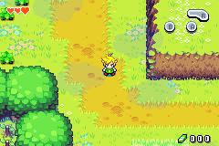
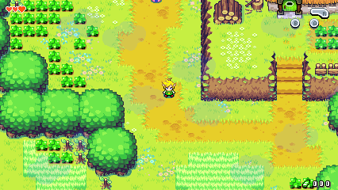
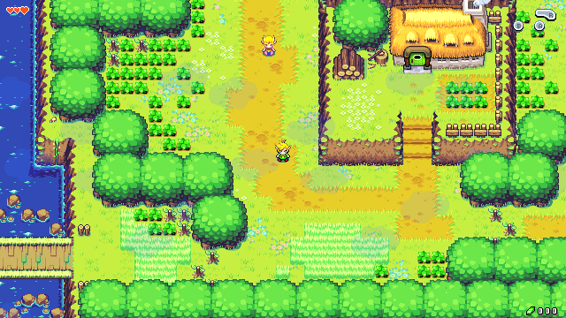
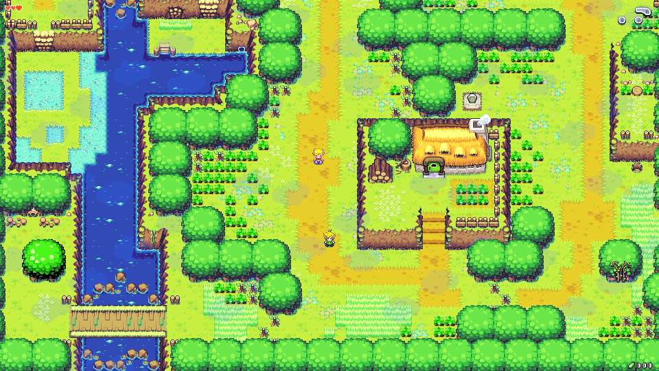
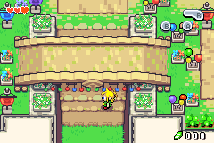
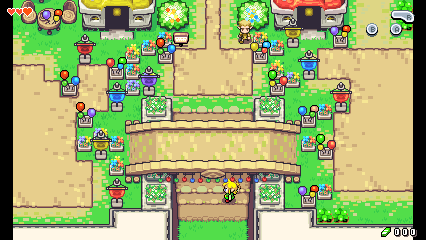
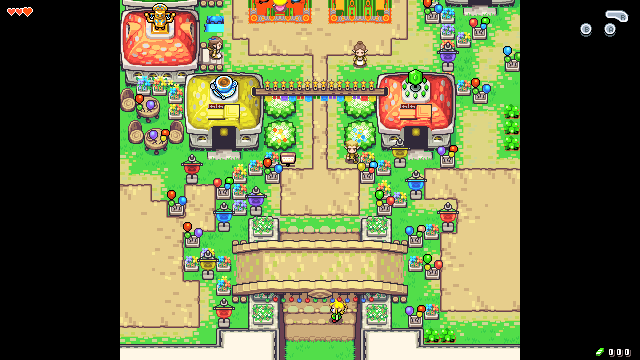
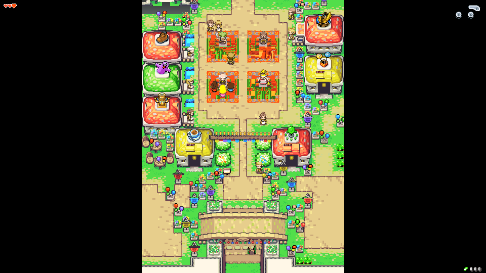

# Native PC port with an extended view

This branch builds the decompilation as a native PC program (SDL2) that can
show **more of the world than the GBA's 240x160 screen**. It contains no game
assets: they are extracted at build time from your own legally obtained ROM
(`baserom.gba`, see [INSTALL.md](INSTALL.md)).

Two values decide how much of the world is visible:

| setting | meaning |
|---|---|
| window size (`window_width`, `window_height`) | size of the window in screen pixels |
| `scale` | size of one game pixel in screen pixels |

The visible area in game pixels is `window / scale`. `scale` 3 in a 1280x720
window shows 426x240 game pixels, scale 2 shows 640x360, and so on. Zoom
changes at runtime with `+` / `-` or the mouse wheel.

## Screenshots

Same save, same spot, different view sizes (images are the raw game-pixel
framebuffer, not upscaled).

South Hyrule Field:

| classic 240x160 | 1280x720 @ scale 3 → 426x240 |
|---|---|
|  |  |

1280x720 @ scale 2 → 640x360:



1920x1080 @ scale 2 → 960x540:



Hyrule Town (the room is narrower than the view, so it is centered with
borders):

| classic | 426x240 | 640x360 |
|---|---|---|
|  |  |  |



## Building

The game code stores pointers in 4 byte data tables, so the port is a
**32-bit x86** program. You need the normal decomp tools (see INSTALL.md),
`baserom.gba`, and:

### Linux

```sh
sudo dpkg --add-architecture i386
sudo apt install gcc-multilib libsdl2-dev:i386
make pc                 # or: make -f pc.mk -j$(nproc)
./tmc_pc
```

If `SDL_config.h` is not found with `-m32`, pass the flags explicitly, e.g.
`make -f pc.mk SDL2_CFLAGS="-I/usr/include/SDL2 -I/usr/include/i386-linux-gnu -D_REENTRANT" SDL2_LIBS="-lSDL2"`.

### Windows (cross compiled with MinGW, or from MSYS2 mingw32)

Get the 32-bit SDL2 development package (`SDL2-devel-2.x-mingw`), then:

```sh
S=/path/to/SDL2-2.30.8/i686-w64-mingw32
make -f pc.mk PC_CC=i686-w64-mingw32-gcc PC_AS=i686-w64-mingw32-as \
    SDL2_CFLAGS="-I$S/include/SDL2 -Dmain=SDL_main" \
    SDL2_LIBS="-L$S/lib -lmingw32 -lSDL2main -lSDL2 -mwindows"
```

Put `SDL2.dll` (from `$S/bin`) next to `tmc_pc.exe`.

macOS is not supported (no 32-bit executables).

## Controls

| GBA | keyboard |
|---|---|
| D-pad | arrows / WASD |
| A | X / K |
| B | Z / J |
| L / R | Q / E (or U / I) |
| Start / Select | Enter / Backspace (or right Shift) |

Gamepads work through SDL's game controller mapping.

| key | action |
|---|---|
| F1 | toggle extended / classic view |
| `+` `-` / mouse wheel | zoom (changes `scale`) |
| F11 | fullscreen |
| Tab (hold) | fast forward |

## Debug tools

| key | action |
|---|---|
| `` ` `` | open the command console (type a command, Enter runs it, Esc closes) |
| F2 | info overlay (area, room, position, frame, view size) |
| F4 | give all items (+20 hearts, full wallet, bombs, arrows) |
| F5 / F9 | quick save / load state (slot 0, `tmc_state0.bin`) |
| F6 / F7 | previous / next room in the area (with Shift: previous / next area) |
| F8 | god mode (health stays full) |

Console commands (numbers can be decimal or `0x` hex):

| command | effect |
|---|---|
| `warp AREA ROOM [X Y]` | go to a room (position relative to the room, default: its center) |
| `room N`, `area N` | room N of the current area / room 0 of area N |
| `next`, `prev`, `nextarea`, `prevarea` | cycle through rooms / areas |
| `pos` | print area, room and player position |
| `items` | give all items |
| `item ID [0-2]` | set one inventory entry (ids: `include/item.h`) |
| `hearts N`, `heal`, `rupees N`, `bombs N`, `arrows N`, `shells N`, `keys N` | stats |
| `god` | toggle god mode |
| `flag N [0/1]` | read / set / clear a global story flag (`include/flags.h`) |
| `savestate [N]`, `loadstate [N]` | savestates in `tmc_stateN.bin` |
| `scale S`, `view`, `hud`, `info` | zoom, extended view on/off, HUD corners on/off, overlay |

Savestates hold the whole game memory, so they only load in the same build
of the game. Some rooms only make sense at a certain point of the story;
warping there early can show missing or odd objects, as with any warp cheat.
Commands can also be scripted: `--cmd 2000:items --cmd "2100:warp 3 1"`.

## Configuration (`tmc_pc.ini`)

```ini
window_width = 1280
window_height = 720
scale = 3
fullscreen = 0
extended_view = 1
integer_scaling = 0
vsync = 1
audio = 1
hud_corners = 1   ; move hearts/buttons/rupees to the corners of the view
save = tmc.sav    ; same 8 KB EEPROM format as emulators
```

Command line: `--width W --height H --scale S --classic --fullscreen
--no-audio --save FILE --config FILE`.

## How the extended view works

* The game logic is unchanged and still runs with its own 240x160 camera.
  The PC view is a larger window placed around it, kept inside the room
  (or centered with borders when the room is smaller).
* The map layers are drawn from the game's pre-rendered tile map of the whole
  room, so real level geometry is shown everywhere.
* Entities are updated and drawn in the extra area too: the game's on-screen
  checks and sprite culling use the larger view.
* Menus, the title screen, the map and other non-gameplay screens use the
  classic 240x160 picture.

## Testing options

`--headless --frames N --keys "100-105:START,200-900/30:A" --shot FRAME
--warp AREA,ROOM,X,Y --cmd FRAME:COMMAND --wav out.wav`; environment variables
`TMC_VIEW_LOG`, `TMC_SOUND_LOG`, `TMC_NULL_LOG`, `TMC_HASH_LOG` (per frame
hash of the game RAM, ignoring native pointers, to compare two builds),
`TMC_NO_NULLGUARD` (to run under a debugger).

## Limitations / known issues

* Tested with the USA ROM. The EU debug overlay is not supported.
* Raster (HBlank) effects designed for 160 lines are stretched over the
  larger view.
* The HUD-to-corner placement is heuristic.
* The original game sometimes reads through NULL pointers (the GBA returns
  BIOS "open bus" data); the port emulates that with a fault handler.
* Rooms only load the entities the game expects to be near the camera, so
  some far away objects may appear when they get close, as on the GBA.
