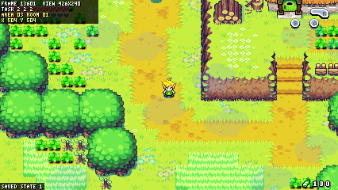

# The Minish Cap — PC port with an extended view

A native PC version of *The Legend of Zelda: The Minish Cap*, built from the
[decompilation](https://github.com/zeldaret/tmc), that can show **more of the
world than the Game Boy Advance's 240×160 screen**.

The repository contains no game assets. They are extracted from your own
legally obtained ROM when you build.


## Contents

- [How much of the world you see](#how-much-of-the-world-you-see)
- [Example images at different scales](#example-images-at-different-scales)
- [Building](#building)
- [Running](#running)
- [Controls](#controls)
- [Settings](#settings)
- [Debug tools](#debug-tools)
- [Known issues](#known-issues)

## How much of the world you see

Two numbers decide it:

| Setting | Meaning |
|---|---|
| window size | the size of the window (or the screen, in fullscreen), in screen pixels |
| `scale` | how many screen pixels one game pixel takes |

**Visible area (in game pixels) = window size ÷ scale.**

| Window | Scale | Visible area | Compared with the GBA |
|---|---|---|---|
| any | — (classic view, F1) | 240×160 | the original picture |
| 1280×720 | 3 | 426×240 | 1.8× the area |
| 1280×720 | 2 | 640×360 | 6× the area |
| 1920×1080 | 3 | 640×360 | 6× the area |
| 1920×1080 | 2 | 960×540 | 13.5× the area |

You can change the zoom while playing with `+`/`-` or the mouse wheel, or by
resizing the window. The game's own camera still follows Link as on the GBA.
The larger view is centred on that picture and stays inside the current room.
Rooms smaller than the view are centred with black borders. Menus, the title
screen and the map use the classic 240×160 picture.

## Example images at different scales

Same spot, same moment. The images show the game's own pixels and are not
upscaled.

### South Hyrule Field

Classic 240×160:


1280×720 window at scale 3 → 426×240:


1280×720 window at scale 2 → 640×360:


1920×1080 window at scale 2 → 960×540:


### Hyrule Town

The town is narrower than the larger views, so it is centred with borders.

| Classic 240×160 | 426×240 | 640×360 |
|---|---|---|
|  |  |  |

960×540:


## Building

You need:

- **Your ROM**: put it in the repository root as `baserom.gba`. It must be the
  unmodified USA version, SHA-1 `b4bd50e4131b027c334547b4524e2dbbd4227130`.
- **The decompilation's tools**: see [INSTALL.md](INSTALL.md) for the
  prerequisites (`build-essential`, `python3`, `pycparser`, `cmake`,
  `libpng-dev`), then run `make tools`.
- **SDL2, 32-bit**: the game code stores pointers in 4-byte tables, so the
  port is a 32-bit x86 program.

### Windows (cross compiled from Linux or WSL)

On Windows, install [WSL](https://learn.microsoft.com/windows/wsl/install) and
run these commands in it.

```sh
sudo apt install gcc-mingw-w64-i686 binutils-mingw-w64-i686
# 32-bit SDL2 for MinGW: SDL2-devel-2.30.8-mingw.tar.gz from
# https://github.com/libsdl-org/SDL/releases
tar -xzf SDL2-devel-2.30.8-mingw.tar.gz
S=$PWD/SDL2-2.30.8/i686-w64-mingw32

make tools
make -f pc.mk -j$(nproc) PC_CC=i686-w64-mingw32-gcc PC_AS=i686-w64-mingw32-as \
    SDL2_CFLAGS="-I$S/include/SDL2 -Dmain=SDL_main" \
    SDL2_LIBS="-L$S/lib -lmingw32 -lSDL2main -lSDL2 -mwindows"
cp $S/bin/SDL2.dll .
```

This gives you `tmc_pc.exe`. Keep `SDL2.dll` in the same folder.

### Linux

Linux works but isn't tested regularly yet.

```sh
sudo dpkg --add-architecture i386
sudo apt install gcc-multilib libsdl2-dev:i386
make pc          # or: make -f pc.mk -j$(nproc)
```

If `SDL_config.h` is not found with `-m32`, pass the flags explicitly:
`make -f pc.mk SDL2_CFLAGS="-I/usr/include/SDL2 -I/usr/include/i386-linux-gnu -D_REENTRANT" SDL2_LIBS="-lSDL2"`.

macOS is not supported, because it can't run 32-bit programs.

## Running

Run `tmc_pc.exe` (or `./tmc_pc` on Linux). The game data is built into the
executable, so the ROM isn't needed after building.

- Settings are saved to `tmc_pc.ini` when you quit (see [Settings](#settings)).
- The save file is `tmc.sav`. It uses the same 8 KB format as GBA emulators, so
  you can copy a save in from an emulator by renaming it to `tmc.sav`, or
  copy one back out.

Command-line options:

```
--width N --height N     window size in screen pixels
--scale F                screen pixels per game pixel (smaller = see more)
--classic                original 240x160 view
--fullscreen
--no-audio
--save FILE              save file (default tmc.sav)
--config FILE            settings file (default tmc_pc.ini)
```

## Controls

| GBA | Keyboard |
|---|---|
| D-pad | arrow keys or WASD |
| A | X (or K) |
| B | Z (or J) |
| L / R | Q / E (or U / I) |
| Start | Enter |
| Select | Backspace or right Shift |

Gamepads work through SDL's controller support.

| Key | Action |
|---|---|
| F1 | switch between the extended view and the classic 240×160 view |
| `+` / `-`, mouse wheel | zoom (changes `scale`) |
| F11 | fullscreen |
| Tab (hold) | fast forward |

## Settings

`tmc_pc.ini`:

```ini
window_width = 1280
window_height = 720
scale = 3              ; screen pixels per game pixel - smaller shows more
fullscreen = 0
extended_view = 1      ; 0 = original 240x160 picture
integer_scaling = 0
vsync = 1
audio = 1
hud_corners = 1        ; move hearts, buttons and rupees to the corners of the view
save = tmc.sav
```

## Debug tools

These tools are meant for testing, and for checking spots where the larger
view matters.

| Key | Action |
|---|---|
| `` ` `` | open the command console: type a command, Enter runs it, Esc closes it |
| F2 | info overlay: frame, view size, area, room, Link's position |
| F4 | give all items, plus 20 hearts, the biggest wallet, bomb bag and quiver |
| F5 / F9 | quick save / load state (slot 0) |
| F6 / F7 | previous / next room in the current area |
| Shift+F6 / Shift+F7 | previous / next area |
| F8 | god mode (health stays full) |



Console commands (numbers can be decimal or `0x` hex):

| Command | Effect |
|---|---|
| `warp AREA ROOM [X Y]` | go to a room. The position is relative to the room; by default you land in its centre |
| `room N` / `area N` | room N of the current area / room 0 of area N |
| `next`, `prev`, `nextarea`, `prevarea` | step through rooms and areas |
| `pos` | show the area, room and position |
| `items` | give all items |
| `item ID [0-2]` | set one inventory entry (IDs are listed in `include/item.h`) |
| `hearts N`, `heal`, `rupees N`, `bombs N`, `arrows N`, `shells N`, `keys N` | change stats |
| `god` | toggle god mode |
| `flag N [0/1]` | read, set or clear a story flag (see `include/flags.h`) |
| `savestate [N]`, `loadstate [N]` | savestates, stored in `tmc_stateN.bin` |
| `scale S`, `view`, `hud`, `info` | zoom; toggle the extended view, the HUD corners and the overlay |
| `help` | list the commands |

Examples:
- `warp 3 1 504 504` takes you to South Hyrule Field.
- `warp 2 0` takes you to Hyrule Town (early in the story the game swaps it for Festival Town).
- `items`, `hearts 10`.

Savestates only load in the same build. Warping to a place the story hasn't
reached yet can show missing or odd objects, as with any warp cheat.

**Scripted test runs:**
- `--headless --frames N` runs without a window and exits after N frames.
- `--keys "100-105:START,200-900/30:A"` gives scripted input.
- `--shot FRAME` saves `shot_FRAME.bmp`.
- `--cmd FRAME:COMMAND` runs a console command at that frame.
- `--warp AREA,ROOM,X,Y` warps once the game is running.
- `--wav FILE` records the audio.

Environment variables:
- `TMC_HASH_LOG=1` prints a hash of the game RAM every frame (to compare two builds).
- `TMC_VIEW_LOG`, `TMC_SOUND_LOG` and `TMC_NULL_LOG` print diagnostics.
- `TMC_NO_NULLGUARD` is for running under a debugger.

## Known issues

- Only the USA version is supported. So far it has been tested mainly on
  Windows: the title screen, the intro, Link's house, Hyrule Town, South
  Hyrule Field, room transitions, saving, sound and the debug tools.
- A few effects that the game draws line by line for a 160-line screen are
  stretched over the larger view.
- Moving the HUD to the corners relies on a heuristic. Set `hud_corners = 0` to
  keep the original position.
- Rooms only create the objects the game expects near its own camera. In very
  large views, some objects pop in as they come within that range, just as on
  the GBA.

More technical details are in [PC_PORT.md](PC_PORT.md). The decompilation's own
GBA build (a matching ROM) is described in [INSTALL.md](INSTALL.md) and still
works.

This project is not affiliated with Nintendo. Please use your own legally
obtained copy of the game.
